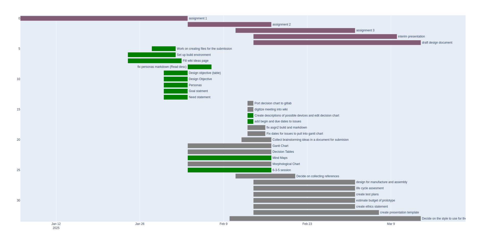

# Assignment 2: Group 2
Lennan Tuffy, Mason Becker, Isabella Phung, Akanksha Rajagopalan, Sulaiman Islam

[Git repository](https://git.ucsc.edu/itphung/cse123-project)

## Brainstorming

## Morphological Charts

| User input       | Output                 | Connectivity                    | Form Factor | Power           |
| ---------------- | ---------------------- | ------------------------------- | ----------- | --------------- |
| Physical buttons | Speaker                | Connectivity                    | Tablet      | Battery powered |
| Touchscreen      | LCD                    | SD Card                         | Watch size  | Rechargable     |
| Camera           | EInk (black and white) | Bluetooth                       | Pocket size | AC adapter      |
| Microphone       | Haptic                 | USB                             | Puck        | Solar           |
| Web interface    | Web interface          | None                            | Desk        | Crank power     |
|                  | Lights (LED)           |                                 | House       |                 |
|                  |                        |                                 | Drone       |                 |
|                  |                        |                                 | Chair       |                 |

## Decision Tables

## Gantt Chart
The gantt chart was made using a modified version of 
[gitlab-gantt-maker](https://github.com/eub-sweden/gitlab-gantt-maker/tree/main)
with a patch found in the `third_party` directory.

## Changes from assignemnt 1
The need and goal statements were modified to fit closer the vision we had for the problem we wanted to solve.

- \input{../common/need_statement}

- \input{../common/goal_statement}

