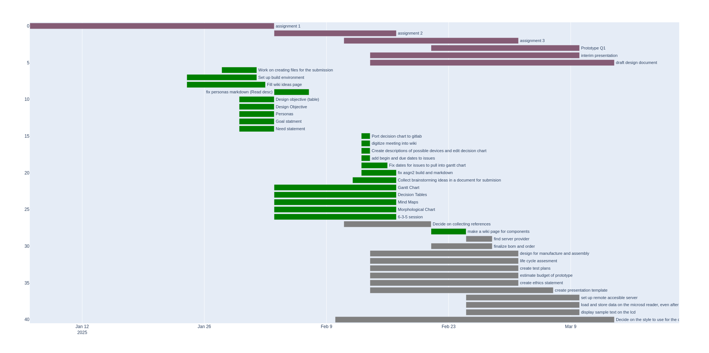

# Assignment 3: Group 2
Lennan Tuffy, Mason Becker, Isabella Phung, Akanksha Rajagopalan, Sulaiman Islam

[Git repository](https://git.ucsc.edu/itphung/cse123-project)

## Design for Manufacture and Assembly
```{.include}
../common/design_for_manufacture_and_assembly.md
```

## Ethics Statement
```{.include}
../common/ethics_statement.md
```

## Budget for Prototype
```{.include}
../common/prototype_budget.md
```

## Life Cycle Assessment
```{.include}
../common/lifecycle_assessment.md
```

## Test Plan
```{.include}
../common/test_plan.md
```

## Updates to information already submitted

### Changes to assignment 1
We updated the need statement as follows:
```{.include}
../common/need_statement.md
```

We updated the design objectives as follows:
```{.include}
../common/design_objective.md
```
### Changes to assignment 2
The gantt chart was updated with new issues added since assignment 2.



# References
:::{#refs}
:::
