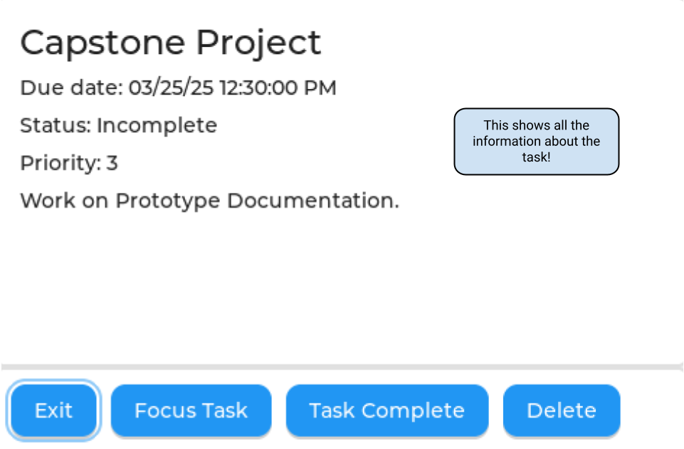

In order to ensure the user fully understands how to utilize the device,
a user tutorial should be provided in a similar fashion to shown in Fig.
[\[fig:user\_tutorial\]](#fig:user_tutorial){reference-type="ref"
reference="fig:user_tutorial"}. Additional panels for user configuration
settings should also be included for user clarity.

{width="\\textwidth"}

{width="\\textwidth"}

{width="\\textwidth"}

{width="\\textwidth"}

{width="\\textwidth"}

{width="\\textwidth"}

{width="\\textwidth"}

{width="\\textwidth"}

{width="\\textwidth"}

{width="\\textwidth"}

{width="\\textwidth"}

{width="\\textwidth"}

{width="\\textwidth"}

{width="\\textwidth"}
