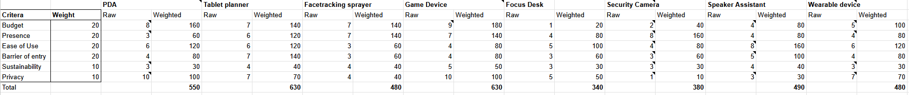

8 general concepts were considered:
- A PDA style, portable device
- Tablet planner
- Facetracking water sprayer
- Game Device
- Focus Desk
- Security camera system
- Speaker Assistant
- Wearable Device

Both the tablet planner and game style device appear to be the most ideal for the considerations given.
