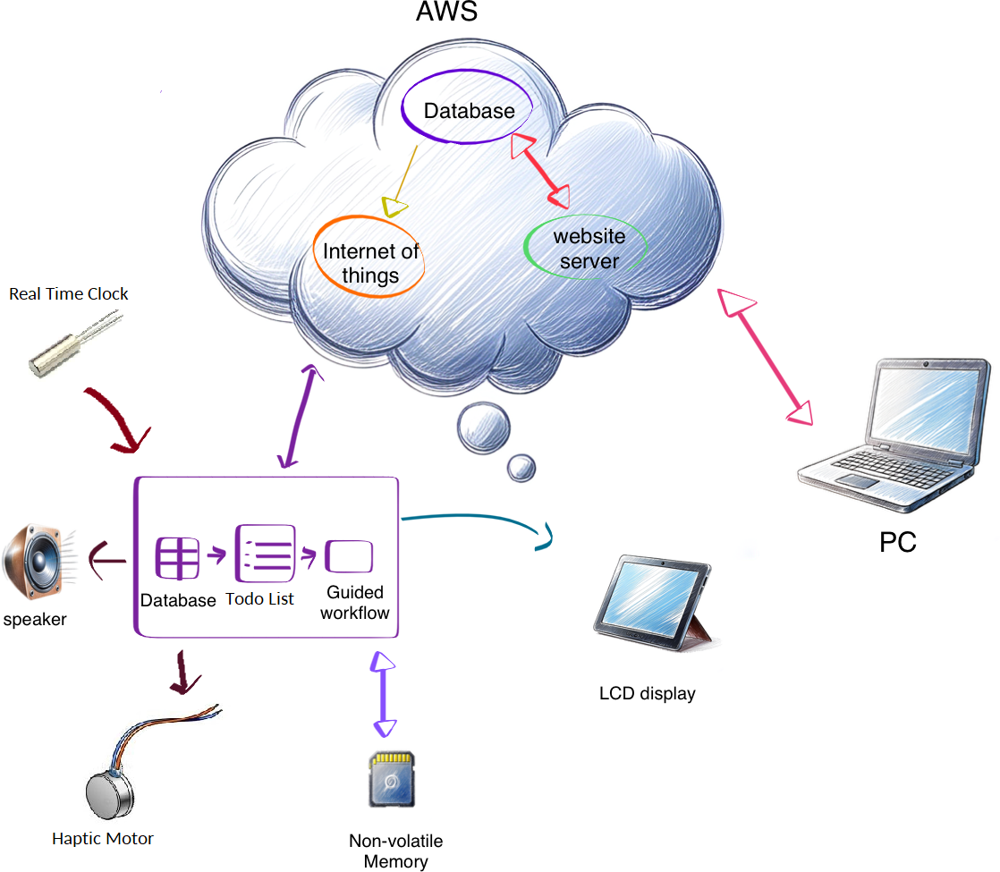
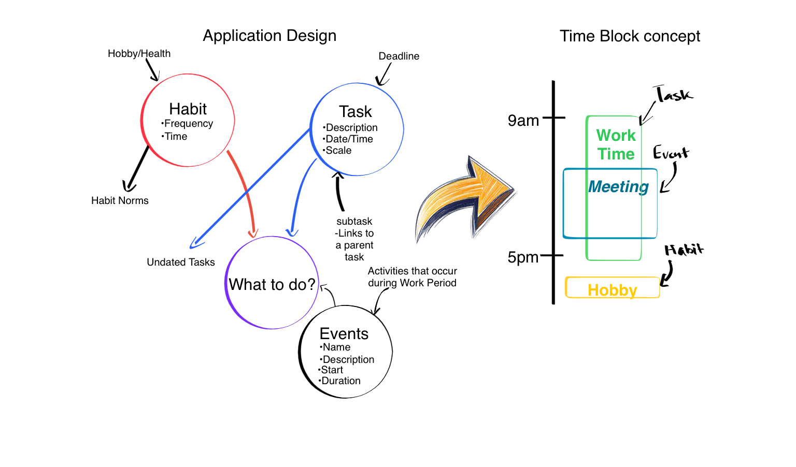

{ width=70% }

## Device Design

The schedule companion is designed to interact with the user based on their provided data entries to guide them through a work flow.

### Time Management

The device uses a Real Time Clock (RTC) and network capabilities to sync and maintain an accurate time. This is the most important data to the device, as it aims to focus entirely on the *here and now*. Thus it only cares about what the user is currently doing, scheduling only when the user should take rest periods. This focus on the present eliminates many of the complexities that the device would have to deal with in a time blocking system. In order to know how much time to dedicate to some project, the user would have to have already finish the project, thus the device would be mostly working off of erroneous data. Instead, our device uses a *work period* to determine when to begin allotting time.

A work period is a section of time defined by the user where they are free to complete tasks, the device can then use this time block to offer the highest priority task to the user, or, at their command, select from a variety of other high priority tasks through the on board controls.

Once a work period is set in motion, they are given a period of time or up until the work period's cutoff to make progress on the entry. This can advantage of the Pomodoro system, which breaks tasks up into increments of work and rest periods to dictate when there should be absolute focus on the topic at hand, represented by the device going into a *focus mode*. In focus mode, the user can only see the amount of time left until their break period, minimizing distractions.

Throughout work periods, the user has full control of the system, they are allowed to pause or conclude at any time or mark the task complete early. During break periods the user will have 3 options: continue, complete, and conclude. Continue is the default option, continuing the current task, complete offers the user a chance to note their task as done, and conclude allows the user to move on to another pressing concern. Of course in order for all of this to work, we need to know what the user needs to do.

### Data Management

As the product focuses on time management, the hardware on board the device relies on data management. The data provided by the user is essential to allow the device to operate, this input data has separate data types for the separate systems of the device, which can be seen below as **Tasks**, **Habits**, and **Events**.

{ width=70% }

Tasks are an objective that must be complete by a target date. These have a description, due date, and scope, which the device uses to derive the priority of such a task. High priority tasks are presented to the user during the beginning of a work period.

Events are time blocks within the internal calender system, they can be marked as busy periods. The device would keep track of these and can present oncoming events, when the user is busy during an event the start of the time block is treated as a cutoff time for a work period if intersecting.

Finally, habits are tasks that are consistently repeated. These entries lack due dates, instead opting for a *frequency*, which allows the user to dictate how often they want to accomplish something. Habits are displayed in a distinct window, allowing the user to keep track of their habits. The device should frequently display this window to remind the user that they should achieve their daily habits.

Notably, in the time block section of Figure \fig{design_logic}, there is an additional block for hobbies. This is an optional extension of the task system, allowing for *undated tasks* which can be used to guide the user though any personal projects they want to achieve without the pressure of a deadline.