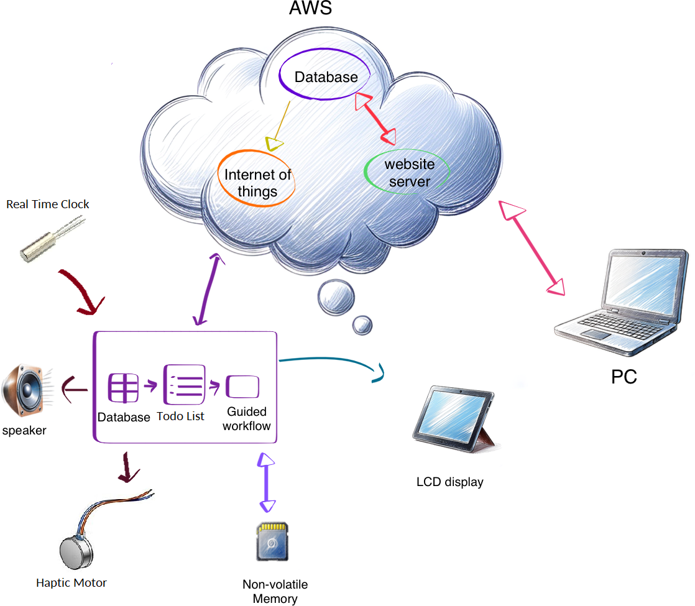
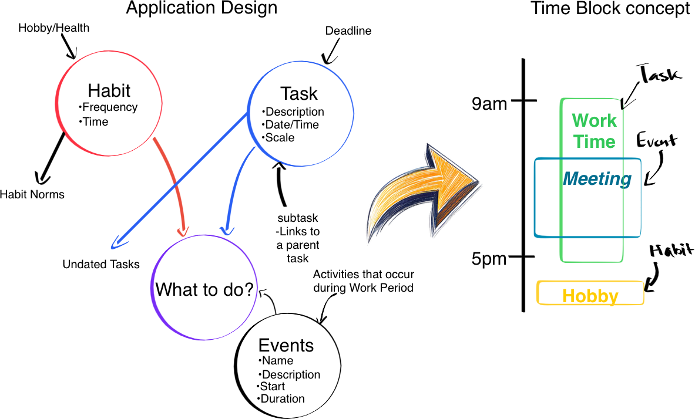

{ width=70% }

## Device Design

The schedule companion is designed to interact with the user through guided workflows based on the data entries they provide, enabling a streamlined approach to task and time management tailored to the user's daily routine and priorities.

### Time Management

To function effectively, the device depends on accurate timekeeping, which it achieves through a Real Time Clock (RTC) in conjunction with optional network synchronization capabilities. Timekeeping is critical because the device emphasizes the *here and now*, presenting the user with only the most relevant current activity rather than attempting to manage a full time-blocked schedule. Traditional time-blocking assumes accurate future estimations from the user, which is often unrealistic. For instance, knowing how long a project will take to complete before starting it would be improbable. To circumvent this, the device uses the concept of a *work period*: a user-defined segment of time during which the device encourages tasks to be completed by the user.

Once a work period is initiated, the device identifies and presents the highest priority task to the user. Alternatively, through onboard controls, the user may browse other top-priority tasks. The work period continues until its predefined cutoff is reached, or the user ends it early. During this time, the device can engage a focus-oriented operating mode inspired by the Pomodoro technique, segmenting work and rest intervals. While in *focus mode*, distractions are minimized: the user interface displays only the task's name and remaining time until the next break, reinforcing attention on the task at hand.

The user maintains complete agency throughout the process. Work periods can be paused, concluded early, or marked complete at any time. Break periods follow a structured prompt system, offering the user three choices: to continue with the current task, to mark it as complete, or to conclude the session and potentially transition to another task. These structured yet flexible workflows help the user remain productive without overcommitting or becoming overwhelmed. For these features to operate meaningfully, the device must maintain a detailed understanding of the user's responsibilities and routines.

### Data Management

To inform the device’s behavior, user-supplied data is categorized into three primary entry types: **Tasks**, **Events**, and **Habits**, each fulfilling a specific role within the internal logic of the system and mirroring aspects of one's day-to-day experiences.

{ width=70% }

Tasks are defined objectives that must be completed by a given deadline. Each task entry includes a textual description, a due date stored as a Unix timestamp, and a priority parameter that conveys the size or effort required as seen by the user. The device uses these values, particularly the due date and priority, to determine task priority and ensure that more urgent or significant tasks are surfaced first during work periods.

Events represent fixed intervals of time and are recorded within the device’s internal calendar. These may include meetings, appointments, or any other scheduled commitments. Events can be treated as *busy periods* and, if busy periods overlap with a work period, their start time is interpreted as a cutoff point. This allows the device to dynamically adjust work periods to avoid scheduling conflicts.

Habits, in contrast to tasks, represent repeated behaviors the user wishes to cultivate. Rather than relying on due dates, habits are defined by a *frequency* metric. This metric is internally represented using a binary bit field, where each of the seven least significant bits corresponds to a day of the week. If a given bit is set high, the habit is expected to be performed on that day. This compact representation avoids unnecessary space consumption and database reads/writes. Habits are displayed within a dedicated interface, frequently shown to remind the user of their daily responsibilities. The design ensures that habit tracking remains prominent but not intrusive.

There is also an auxiliary category visible in Figure \ref{design\_logic} labeled *hobbies*. These are undated task entries, included as a means for users to track long-term personal projects or leisurely goals without the pressure of deadlines. By omitting due dates, hobbies serve as a gentle encouragement rather than an obligation, however the device will offer the same focus mode functionality for these low priority achievements as was introduced for work periods. The device would rely on the priority parameter dictated by the user to order the entries such that the user can readily choose a task that they find most pressing or prominent.

## SQL Integration

The relationships between tasks, habits, events, and their associated data are maintained using a relational SQL database. This model was chosen for its robustness in expressing complex data interrelations and its efficiency in handling queries related to sorting, filtering, and retrieving contextual information.

Each primary data category: tasks, habits, events, and habit entries, is mapped to its own table within the database. These tables mirror the structure and logic described previously. For instance, task entries store a textual name and description, a Unix timestamp representing the due date, and a priority field. Unix time was selected as the time representation format because it enables consistent numerical operations, such as sorting by ascending time or computing time differences.

The task priority field plays a dual role: it captures the user's sense of urgency and informs the device’s task sorting logic. Sorting is governed by a formula: $\text{Date} - \text{Priority} \times \text{Multiplier}$, where the multiplier is a constant that converts the priority value into a time offset. This transformation allows tasks with higher urgency to rise in importance even if their due dates are farther out.

Habit frequency, as mentioned earlier, is stored in a single numerical field interpreted as a 7-bit value, with each bit representing one day of the week. Since SQL lacks a dedicated bit-field datatype, this field is read and manipulated at the application level. As long as both the server and client interpret this integer consistently, the system can efficiently determine on which days a habit should be active, without requiring additional columns or redundant data.

Tracking user adherence to habits is managed through a separate *habit entry* table. Each entry records whether the user completed a habit on a specific day, using a timestamp truncated to the start of the day via the formula $\text{date} = \text{time} - (\text{time} \bmod 86400)$. This approach ensures that all entries for a given day are uniformly referenced, facilitating both retrieval and statistical analysis. Additional numerical fields may be included in the habit entry to represent progress toward more granular goals, such as step counts or hydration targets. The presence of a habit entry alone may suffice to indicate completion, while its removal serves as a mechanism for user correction to indicate incompletion.

This entry-per-day model offers a balance between precision and efficiency. It allows the device to track how consistently users meet their goals without bloating the database with unnecessary metadata. All of this contributes to a responsive, insightful interface that helps users stay on track while minimizing the cognitive overhead typically associated with time management tools.
