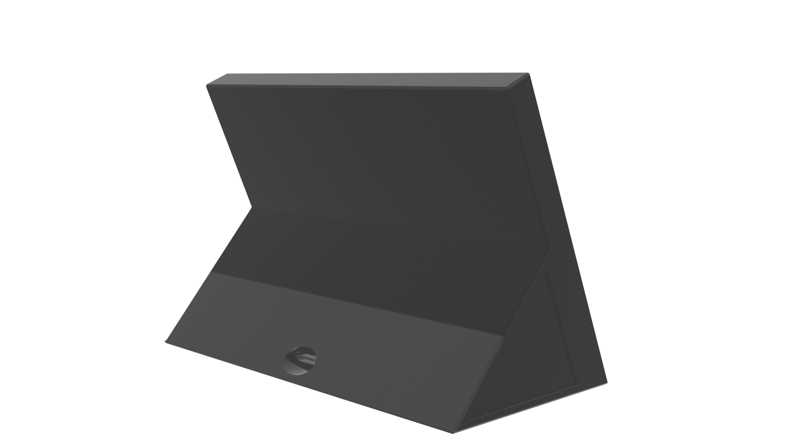

## Device Casing

{ height=40% }

{ height=40% }

The triangular volume on the back of the device serves as a kickstand and where some of the PCB modules are located. In addition, the trangular kickstand keeps center of gravity low, making it difficult to tip over. This space is also necessary to fit two 3500mAh 18650 battery cells which we selected over a specific pouch battery for repairability and it provides room for easily assembly and disassembly.

The screen of the device is tilted at comfortable viewing angle and includes two slits for the speakers, as well as a power button and the 7.5 inch LCD touchscreen.

As described in \hyperref[DMA]{design for manufacture and assembly}, the chassis will be made of a combination of recycled polymers, bioplastics, and recycled aluminum where metal is necessary. The device must have a screen protector applied to the LCD screen to protect the surface from scratches. In addition, strips of neoprene are added around the edges of screen as well as the front edge of the screen to serve as a cushion for the screen in the event the device is dropped. The chassis utilizes zinc plated carbon steel screws to make dissassembly and repair easy. Threaded metal screw inserts will be melted into the plastic chasis as these are more durable and reusable in comparison to threading the screws directly into the plastic housing. The screw holes are covered with small rubber screw hole plugs to hide the screws, and reduce any possibility of dust or debris getting stuck in the screw holes. 

