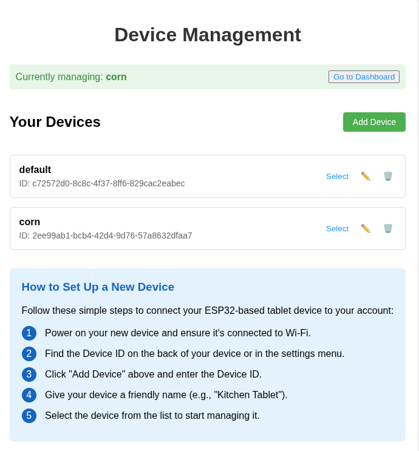
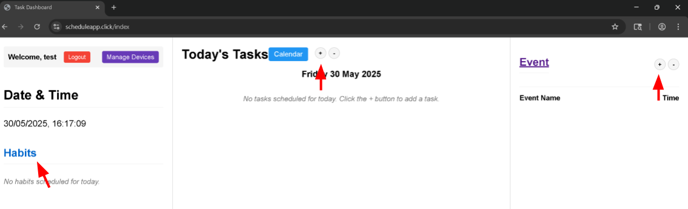

Welcome to your new productivity partner!
Start with connecting your device to the provided power supply.
When the device displays the following screen, the device is ready to be connected to the internet.

Connect to the indicated acces point with your personal device. It will redirect you to a page where you can enter your wifi information.

Once complete, your productivity partner is ready for your schedule!

Be sure to log in or create an account at [scheduleapp.click](scheduleapp.click) or you can scan this QR code! 

Once logged in, you'll see the following screen. Follow the instructions on screen to add your device. 

1. Power on your new device and ensure it's connected to Wi-Fi.
2. Find the Device ID on the back of your device or in the settings menu.
3.  Click "Add Device" above and enter the Device ID.
4. Give your device a friendly name (e.g., "Kitchen Tablet").
5.  Select the device from the list and click "Go to Dashboard" to start managing it.

You can now add tasks, habits, and events via the web app and they will show up on the device!

Be sure to customize your device's timezone and in the settings window of the website!
