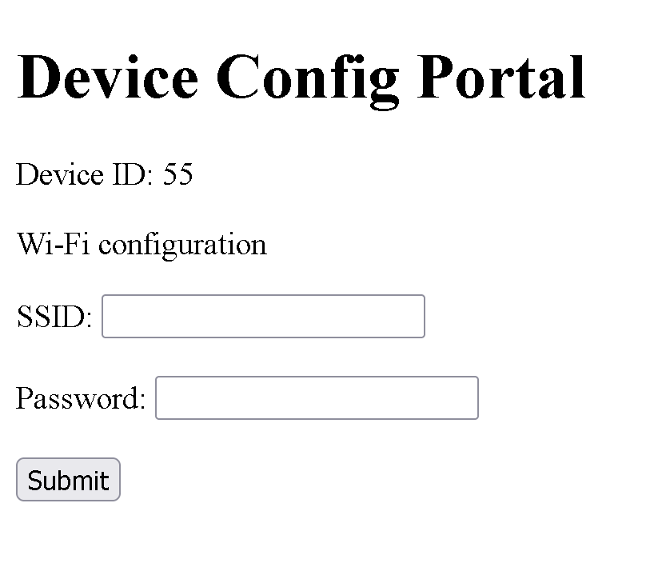

### Data cloud synchronization test report \label{cloud_test}
\noindent
**Test Purpose**:
This is intended to verify that the device is capable of connecting to the internet and synchronizing with server information.

\noindent
**Test Procedure**:
Exact testing procedures can be found at \ref{cloud_procedure}. Results are visually observed.

\noindent
**Test Results**:

- Device was booted with no information to connect to the internet
- Connected to prototype device via SoftAP as shown in the fig. \ref{portal} and entered in wifi credentials

    {width="50%"}

- Logged into scheduleapp.click using an existing test account as shown in the fig. \ref{login}
    
    {width="50%"}

- test user has no devices listed as shown in fig. \ref{no_device} so the test device was added as shown in fig. \ref{add_device}
    
    {width="50%"}
    
    {width="50%"}
- Dashboard was empty, so added multiple test tasks, habits, and events as shown in fig. \label{test_schedule}
    
    {width="50%"}

- After pressing the synch button on the prototype, the prototype updated and displayed the new schedule information

\noindent
**Final Analysis**:
The device passes. It is able to connect to wifi and display user information from the server.
