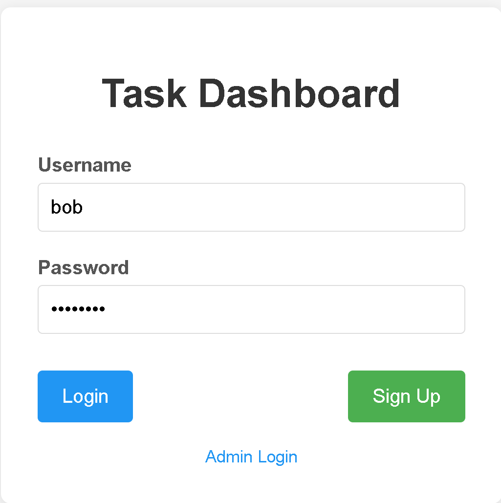
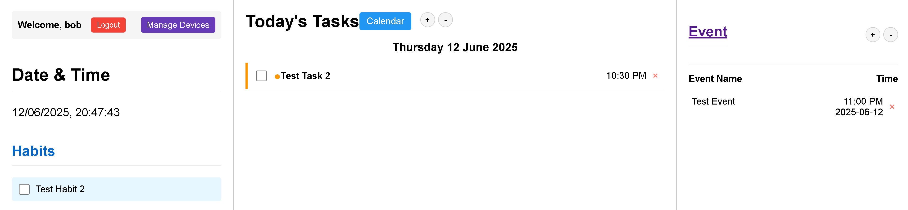
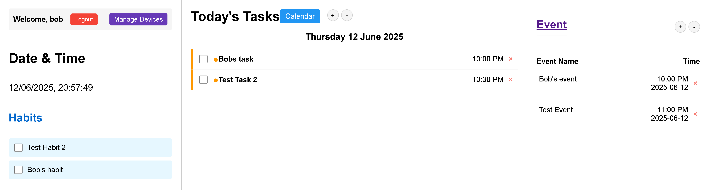

### Many Users to One Device
\noindent
**Test Purpose**:
This is intended to verify that the device is capable of many users to one device.

\noindent
**Test Procedure**:
Exact testing procedures can be found at \ref{many_procedure}. Results are visually observed.

\noindent
**Test Results**:

- Device had existing user data on it from \ref{cloud_test} so test is begun from step 7
- Created a second user and logged in as shown in fig. \ref{second_user}

    {width="50%"}

- added the same device ID
- upon entering the device's dashboard, all of the schedule information from the initial account are visible and editable as shown in fig. \ref{same_content}

    {width="50%"}

- In the second account, added new tasks and events as shown in fig. \ref{new_info}
    
    {width="50%"}

- After pressing the sync button on the device, the device updated with the new tasks added from the second user

\noindent
**Final Analysis**:
The device passes. The device is able to display schedule information for both users and the web app also shares the information between the two users.
