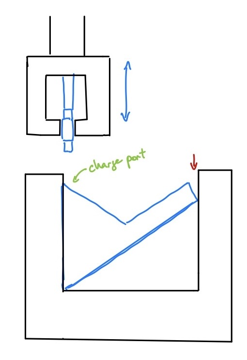

### Port Durability
Introduction: The USBC port is the main way the device gets recharged and is subject to wear as the user plugs and unplugs the device. In order to verify the longevity of the device, the charging port of the device is subject to 1000 plug cycles.

Scope: Charging port, strength test 

Apparatus: productivity device, plug durability testing apparatus, USBC cable.

Independent variables: Pressure

Dependent variables: Charge port durability

Procedure:
1. Take pictures of the charge port before beginning the test.
2. Set up the port durability testing machine based off of fig. \ref{fig:port}. The portability device is an uneven shape which makes it difficult to clamp on to. Ensure that the clamp is not deforming the shape of the device. The red arrow indicates an area in which some manner of wadding or firm sponge could be placed to better conform to the shape of the device and provide stability during testing. Make sure the device setup is clamped to the port durability testing device to prevent shifting. Ensure that the end of the USBC cable is properly aligned such that as the arm descends, it will plug into the productivity device.

{width="50%"}

3. Program the device to plug and unplug 1000 cycles.
4. Run the first 10 tests supervised, afterwards check on the device every 30 minutes to ensure the test is progressing smoothly.

Expectation: The productivity device's USBC port is expected to withstand a minimum of 1000 plug cycles. 
