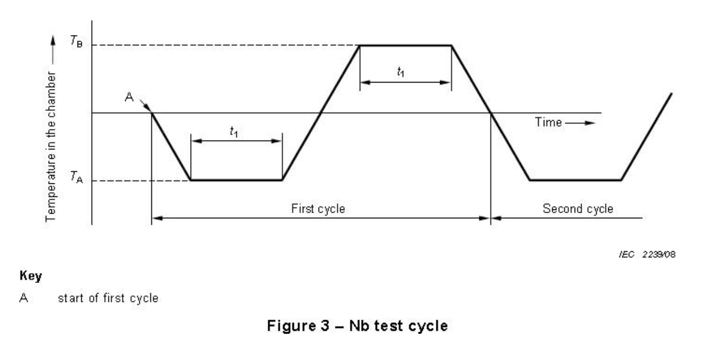

### Thermal Cycling: Cold and Dry Heat
Introduction: Thermal Cycling exposes samples to extreme temperature changes, which replicate accelerated aging of the device and ensures that the sample can operate at its rated maximum and minimum temperatures. Test procedures follow [IEC 60068-2-14](https://www.sz-sts.com/static/upload/file/20230317/1679038143929808.pdf) thermal cycling procedures.

Scope: Operating temperatures, full functionality

Apparatus: productivity device, host machine for functionality tests, thermal testing chamber

Independent variables: full device functionality

Dependent variables: chamber temperature and humidity

Procedure:

1. Place the device inside of the thermal chamber.
2. Feed a cable connecting the device through the port of the thermal chamber. Connect the end of the cable to the monitoring host machine. Check that the productivity device is on, connected to the internet and is loaded with an existing test account with tasks, events, and habits. Host machine should be set up to monitor device functionality for the entire duration of the test.
3. Close the test chamber.
4. Enter temperature profile into test chamber settings in accordance to IEC 60068-2-14 with a temperature maximum of 85C and a minimum of -40C in accordance to typical maximum and minimum operating temperatures of FR4 PCBs[^1] and microcontrollers[^2]. Up and down ramp should be set to 5C/min. Dwell at min and max temperatures for 3hrs each. Perform a total of two cycles, then set the chamber return to 25C with a ramp of 5C/min and dwell for 2 hrs to allow the device to return to room temperature. Ensure humidity is set as low as possible.

{width="50%"}

Expectation: Device should remain operational through then entire duration of the test and outer casing should be free of cracks and remain structurally intact.

[^1]: https://fr4material.com/index.php/understanding-fr4-sheet-temperature-specifications/
[^2]: https://copperhilltech.com/content/The%20Operating%20Temperature%20For%20A%20Raspberry%20Pi%20%E2%80%93%20Technologist%20Tips.pdf
