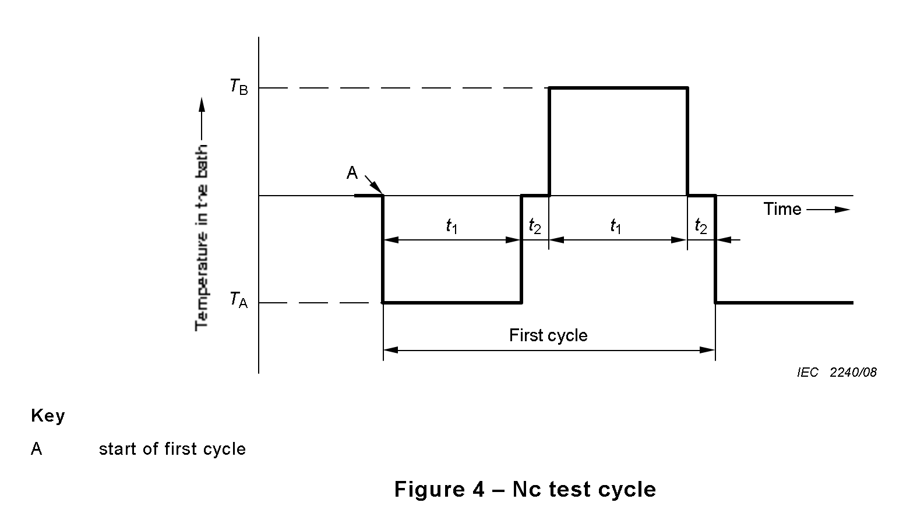

### Thermal Shock: Air to Air
Introduction: Plastics and PCBs when exposed to sudden changes in temperature can experience cracking and solder joints can fail. Thermal shock testing is performed accordance to [IEC 60068-2-14](https://www.sz-sts.com/static/upload/file/20230317/1679038143929808.pdf). The temperature maxima of 85C and a minima of -40C in accordance to typical maximum and minimum operating temperatures of FR4 PCBs[^1] and microcontrollers[^2].

Scope: Operating temperatures, full functionality

Apparatus: productivity device, 2x host machine for functionality tests, 2x thermal testing chambers or a thermal shock testing chamber

Independent variables: full device functionality

Dependent variables: chamber temperature and humidity

Procedure for 2x thermal testing chambers:

1. Remove the device's lithium ion cells and set them aside. Place the device atop a flat surface such as wood or a metal tray.
2. Feed a cable for the host machine through the port of the thermal chamber. Connect the end of the cable to the monitoring host machine.
3. Before connecting the productivity device, close and cool the test chamber to the temperature minimum of -40C. Down ramp should be set to 5C/min.
4. Once thermal chamber is stable at the minimum temperature, open the test chamber and place the device and the tray inside of the thermal chamber.
5. Wearing gloves, connect the cable from the host machine into the productivity device. Check that the productivity device is on, connected to the internet and is loaded with an existing test account with tasks, events, and habits. Host machine should be set up to monitor device functionality for the entire duration of the test. Device should be dwell at this temperature for 3hrs.
6. Set up a second host machine in the second thermal chamber in the same way as the first thermal chamber. Close and heat the chamber to 85C with an up ramp of 5C/min.
7. Open both test chambers and unplug the device while wearing protective gloves or using tongs. Transfer the device to the second hot chamber as quickly as possible. Plug the productivity device into the second monitoring host device, ensure the device is recieving power and communicating to the host device. Close the test chamber. Device should dwell at this temperature for 3hrs.
8. Repeat the transfer process from the cold chamber to the hot chamber. Perform a total of two cycles, then set the chamber to return to 25C with a ramp of 5C/min and dwell for 2 hrs to allow the device to return to room temperature.

Procedure for a thermal shock testing chamber:
1. Remove the device's lithium ion cells and set them aside. Feed a cable for the monitoring host machine through the port of the thermal chamber. 
2. Set one chamber to 85C and the other to -40C. 
3. Close the test chamber.
4. Once the chambers are at stable temperature. While wearing protective gloves, place the productivity device inside of one of the chambers of the thermal chamber. Connect the cable to it and check that the productivity device is on, connected to the internet and is loaded with an existing test account with tasks, events, and habits. Host machine should be set up to monitor device functionality for the entire duration of the test. Device should be dwell at this temperature for 3hrs.
5. After 3 hrs, drop the device to the lower chamber. Device should dwell at this temperature for 3 hrs.
6. Raise the device to the upper chamber to repeat the thermal shock cycle one more time. After the cycles are complete, set the chamber to return to 25C and dwell for 2 hrs to allow the device to return to room temperature.

{width="50%"}

Expectation: Device should remain functional through then entire duration of the test and outer casing should be free of cracks and remain structurally intact.

[^1]: https://fr4material.com/index.php/understanding-fr4-sheet-temperature-specifications/
[^2]: https://copperhilltech.com/content/The%20Operating%20Temperature%20For%20A%20Raspberry%20Pi%20%E2%80%93%20Technologist%20Tips.pdf
