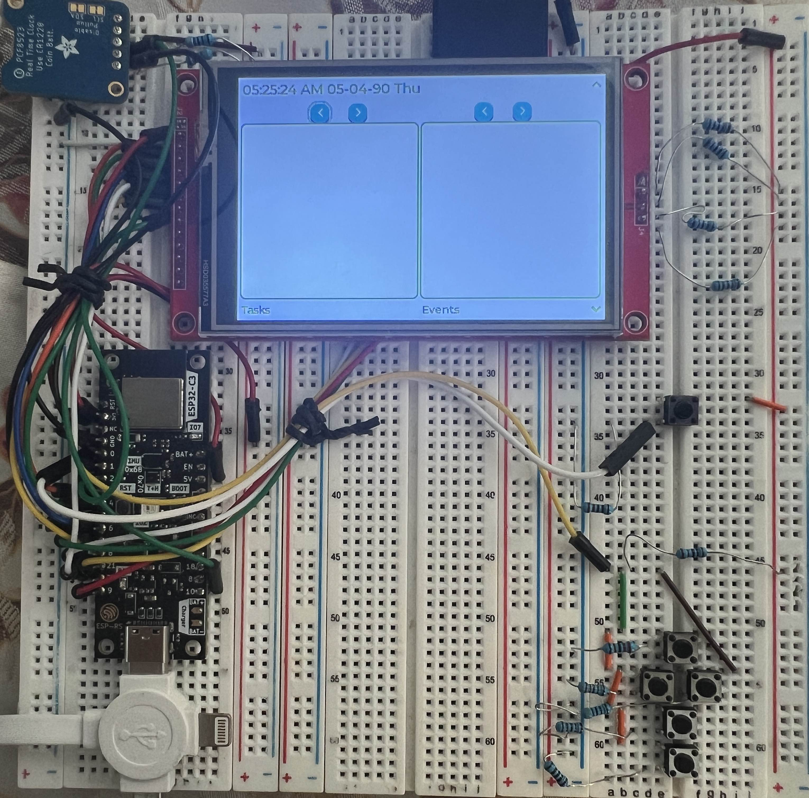
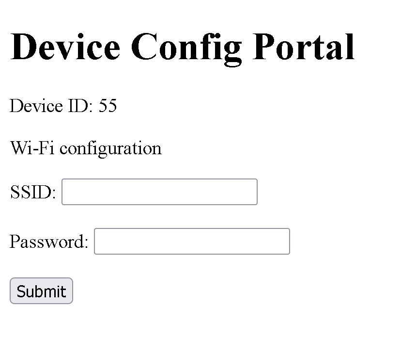

### Wifi Connection test report \label{wifi_test}
\noindent
**Test Purpose**:
This is intended to verify that the device is capable of connecting to the internet.

\noindent
**Test Procedure**:
Exact testing procedures can be found at \ref{wifi_procedure}. Results are visually observed.

\noindent
**Test Results**:

- Device was booted with no information to connect to the internet as shown in fig. \ref{clean_device}
    
    {width="50%"}

- Connected to prototype device via SoftAP as shown in the fig. \ref{portal} and entered in wifi credentials

    {width="50%"}

- After pressing the synch button, the device displayed a wifi symbol at the top right.

\noindent
**Final Analysis**:
The device passes. It is able to connect to wifi as expected.
