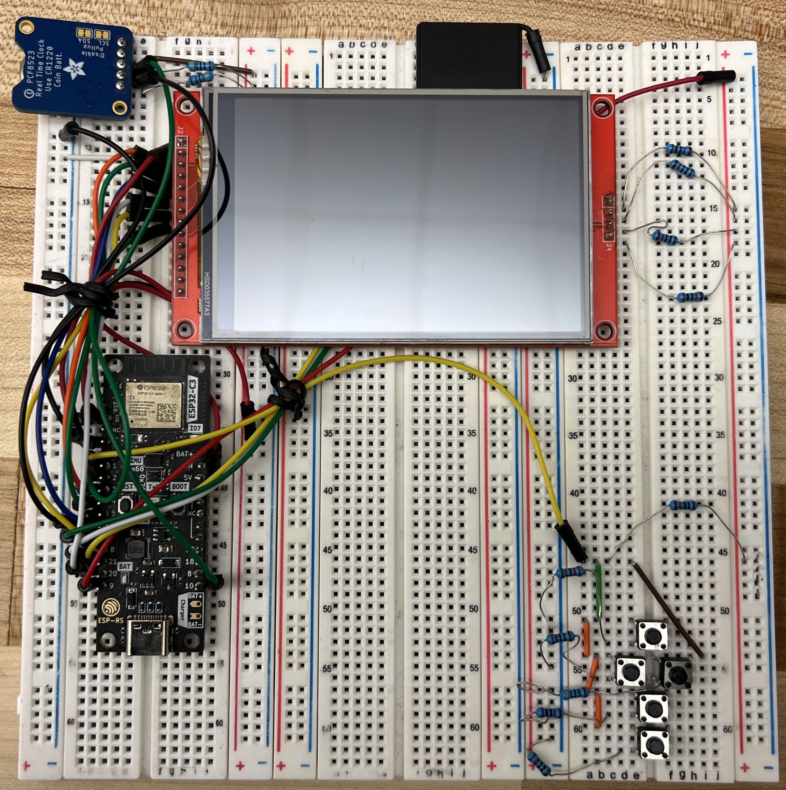
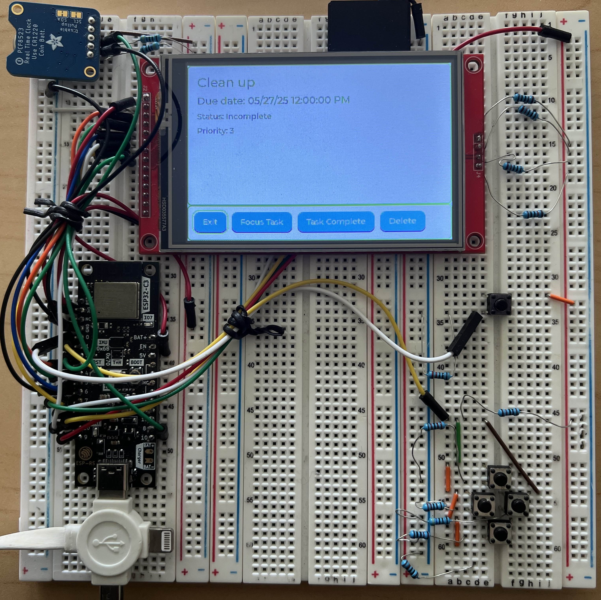
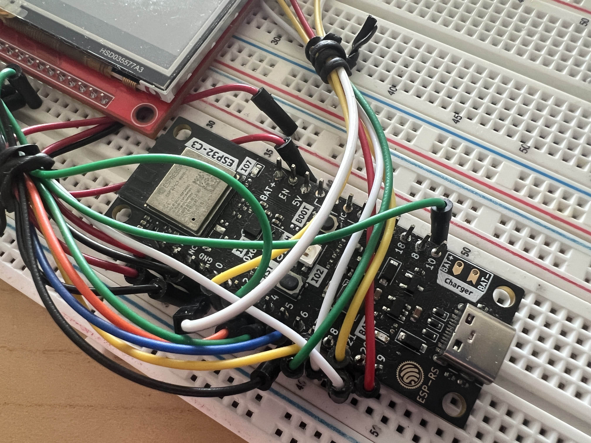
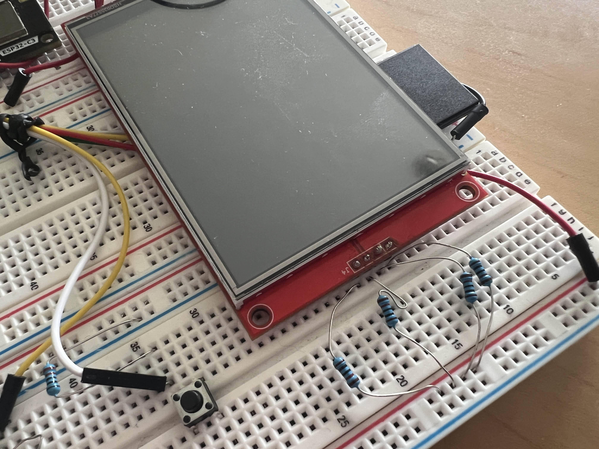
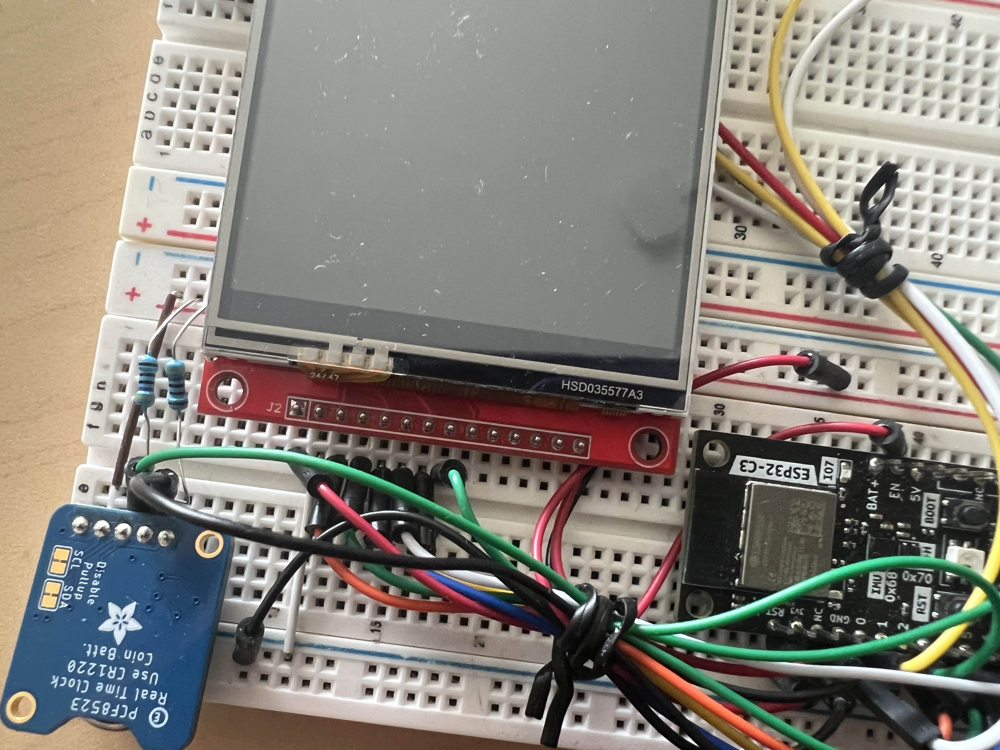
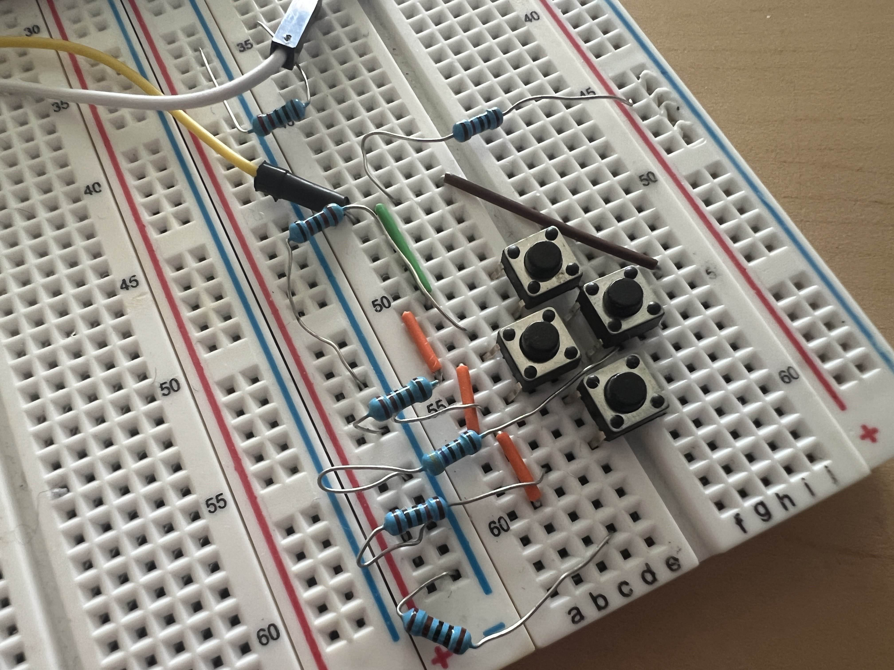
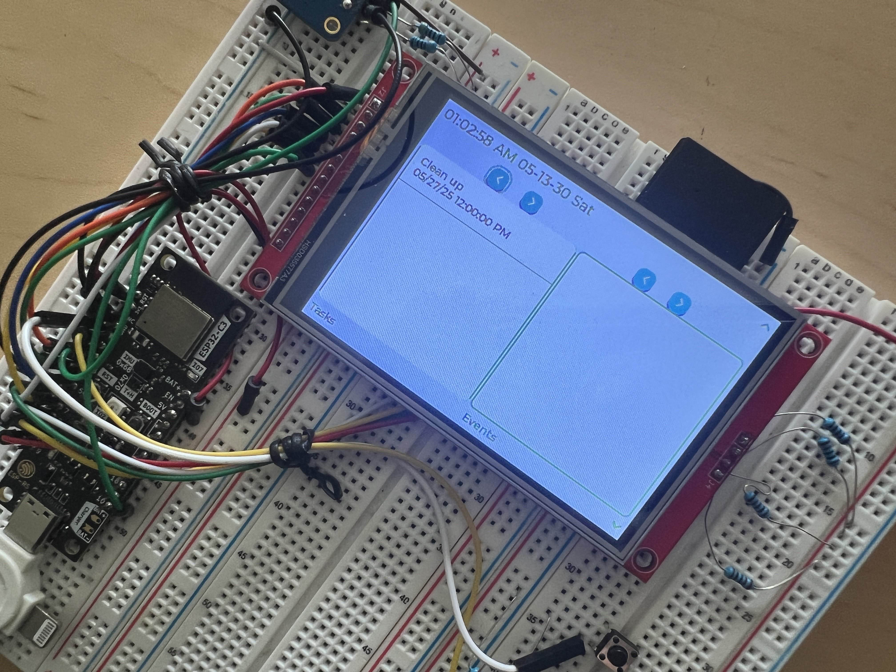

### Hardware {#proto_hw}
Images of the prototype are found in figures \ref{prototype1} to \ref{prototype7}.
The prototype consists of the microcontroller dev-board, an 3.5 inch LCD touch screen breakout board, a real-time clock breakout board, and several tactile buttons for navigating the UI of the device.
The wiring diagram for the prototype is described by Figure \ref{proto_schem}

- **ESP32-C3-DevKit-RUST-1**: A microcontroller board featuring the ESP32-C3 SoC.
- **MSP3520**: An inexpensive, SPI TFT LCD touch screen that comes with an SD card reader.
- **Adafruit 3295**: A breakout board for the PCF8523 real time clock.

{ height=40% }

{ height=40% }

{ height=40% }

{ height=40% }

{ height=40% }

{ height=40% }

{ height=40% }

